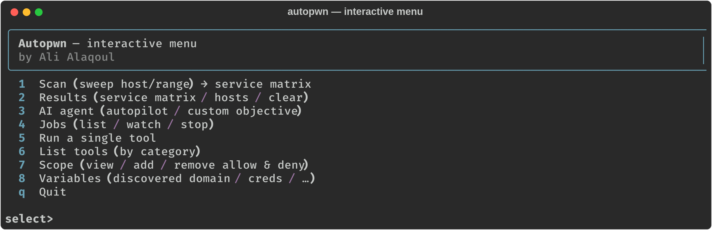
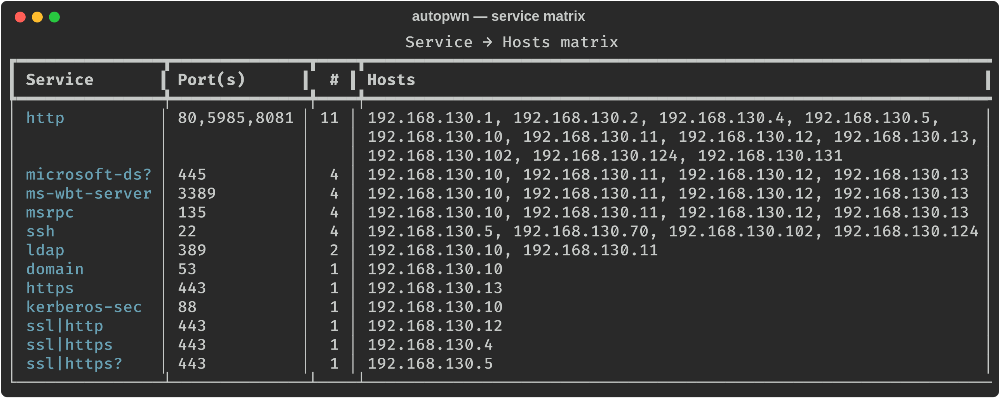
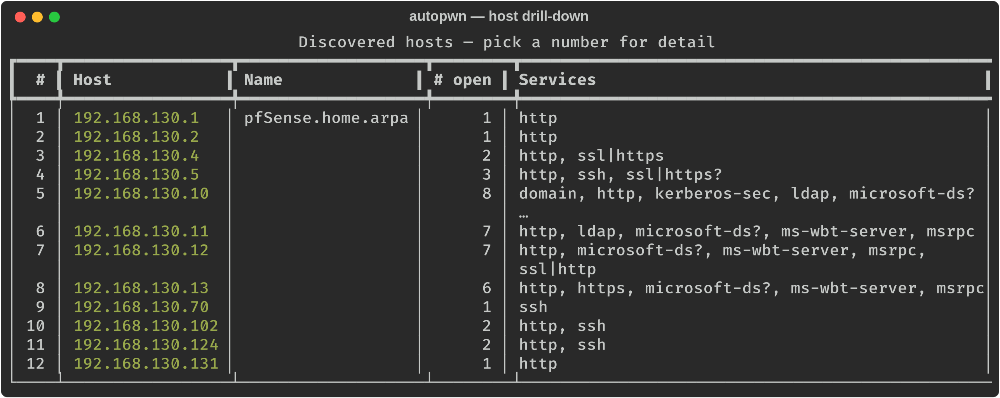
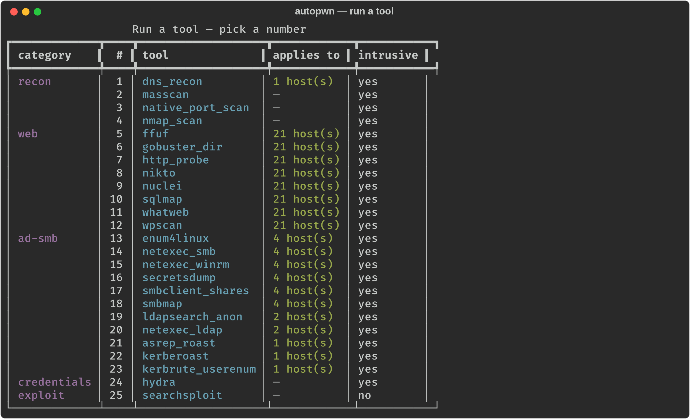
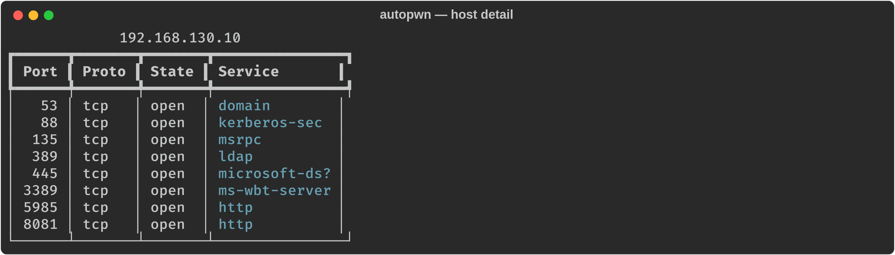
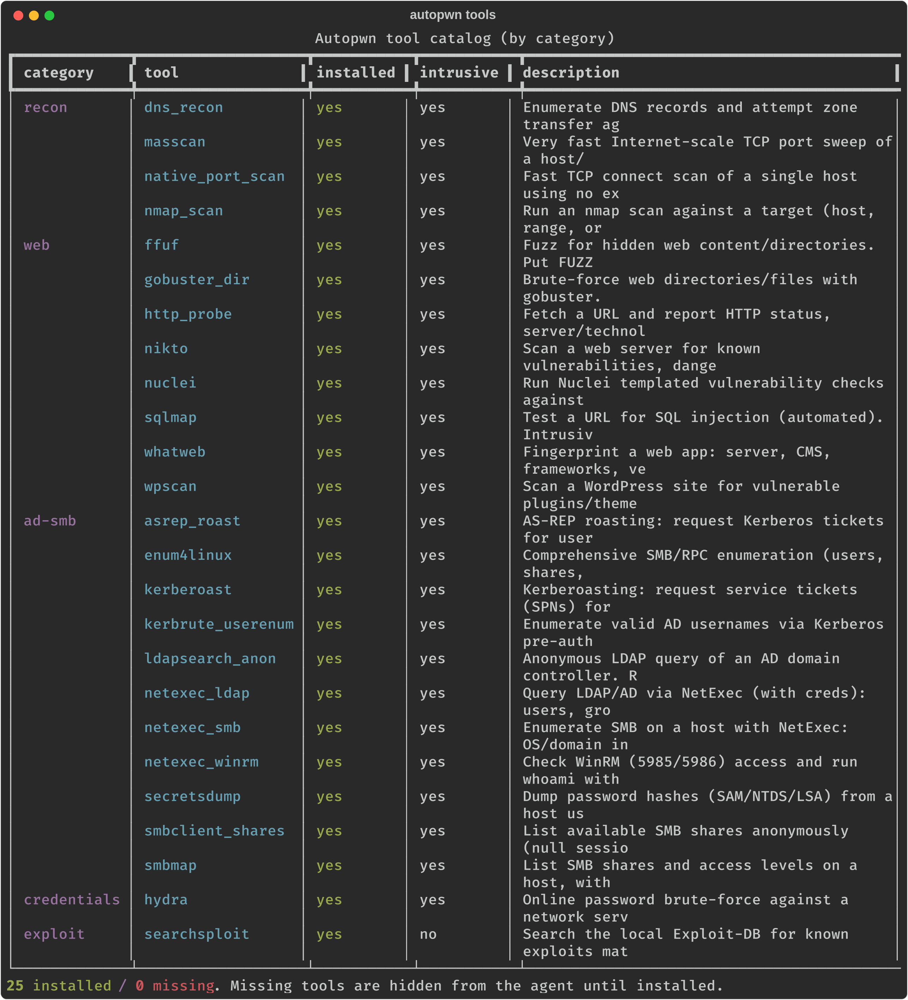
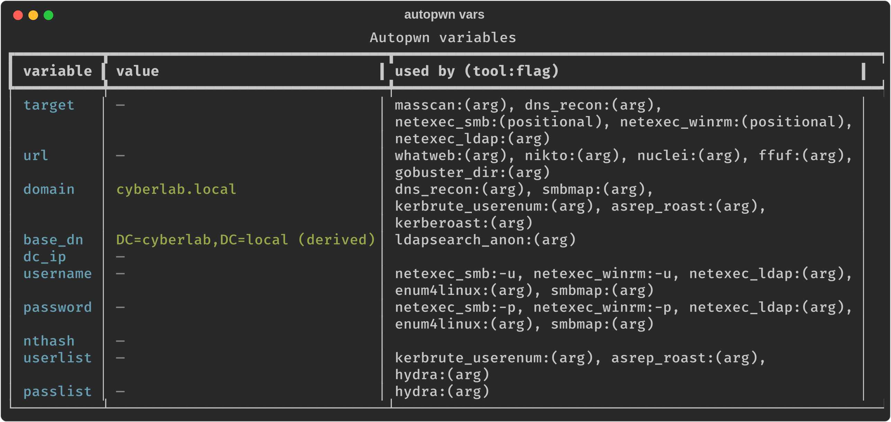

# Autopwn

**An AI agent that orchestrates real security tools to test the security of
networks, web applications, Active Directory, and other systems — driven by a
local or cloud LLM, and gated by an explicit authorization scope.**

Autopwn does not reinvent scanners. It *orchestrates* the industry-standard
ones — nmap, netexec, nuclei, impacket, ffuf, and more — the way a human operator
does: it plans a methodology, picks the right tool, reads the raw output,
correlates findings, and decides the next step. You can point it at a target and
let it run on **autopilot**, or drive individual tools yourself.

- **Author:** Ali Alaqoul — <alialaqoul@gmail.com>
- **License:** MIT

## Screenshots

Interactive menu and the service→hosts matrix (real output against a lab range):

<p align="center">
  
  
</p>

---

## ⚠️ Legal and authorized use only

This tool is for **authorized security testing, education, and defensive
research only.** It refuses to run against any target that is not listed in an
authorization *scope* file that you define. Testing systems you do not own or
lack **written permission** to test is illegal in most jurisdictions. You are
solely responsible for staying within your authorized scope. The software is
provided "as is", without warranty (see [LICENSE](LICENSE)).

---

## Features

- **Pluggable AI backends** — OpenAI, Ollama, AnythingLLM, LM Studio, or any
  OpenAI-compatible endpoint. Local models run fully offline.
- **Authorization gate** — every tool call is checked against your scope
  (allow/deny CIDRs, hostnames, and an expiry date) before any packet is sent.
- **Full tool coverage** — 24+ tools across network, web, SMB/Active Directory,
  and credential testing, run through a safe, auditable wrapper.
- **Autopilot** — give it just a target and it fingerprints the host, then
  adapts its methodology to whatever it is (DC, IIS/nginx/Apache, database, mail,
  remote-access host, …).
- **Text tool-call fallback** — works even with smaller local models that don't
  support structured function-calling.
- **Extensible** — add a new tool with a few lines of declarative config.
- **Full transcripts** — every agent session is logged to JSON for reporting.

---

## Architecture

```
CLI (autopwn)
  └── Agent  ── reason → act → observe loop
        ├── LLM provider   (OpenAI / Ollama / AnythingLLM / any OpenAI-compatible)
        ├── Tool registry  (auto-loads only tools installed on the host)
        └── Authorization  (scope gate — enforced on every tool)
```

---

## Requirements

- **Python 3.10+**
- A Linux host is strongly recommended for the security tools — **Kali Linux**
  ships with almost all of them preinstalled. (The core agent and the native
  scanners run on Windows/macOS too.)
- An LLM backend: a local **Ollama** install (recommended for offline use) or an
  API key for a cloud provider.

---

## Installation

### 1. Get the code and Python dependencies

```bash
git clone https://github.com/<your-username>/autopwn.git
cd autopwn
python3 -m venv .venv
source .venv/bin/activate            # Windows: .venv\Scripts\activate
pip install -e .                     # installs deps + the `autopwn` command
```

After `pip install -e .` you can run **`autopwn`** directly. If you'd rather not
install, use `python -m autopwn` in place of `autopwn` everywhere below.

### 2. Install the security tools (Kali Linux)

Most are already present on Kali. To be sure:

```bash
sudo apt update
sudo apt install -y nmap masscan dnsrecon whatweb nikto ffuf gobuster \
  wpscan sqlmap netexec smbmap smbclient ldap-utils enum4linux-ng hydra \
  exploitdb nuclei

# kerbrute is not in apt — install the prebuilt binary:
sudo curl -fsSL -o /usr/local/bin/kerbrute \
  https://github.com/ropnop/kerbrute/releases/latest/download/kerbrute_linux_amd64
sudo chmod +x /usr/local/bin/kerbrute

# impacket (GetNPUsers, GetUserSPNs, secretsdump, …):
pipx install impacket        # or: sudo apt install -y python3-impacket
```

Tools you don't install are simply hidden from the agent — nothing breaks. Check
what's available any time with `python -m autopwn tools`.

### 3. Install and start an LLM (Ollama, recommended)

```bash
curl -fsSL https://ollama.com/install.sh | sh
ollama pull llama3.1:8b              # good tool-calling; ~4.9 GB
```

Ollama then serves an OpenAI-compatible API on `http://localhost:11434`.

---

## Configuration

Copy the examples and edit them:

```bash
cp config.example.yaml config.yaml
cp scope.example.yaml  scope.yaml
```

### `config.yaml` — pick your AI backend

```yaml
llm:
  provider: ollama                    # openai | ollama | anythingllm | openai_compatible
  model: llama3.1:8b
  base_url: http://localhost:11434/v1
  temperature: 0.2
  request_timeout: 600                # high, because local CPU inference is slow
agent:
  max_steps: 25
  confirm_active_actions: false       # true = ask before each intrusive tool
```

Default base URLs are filled in per provider if you omit `base_url`:

| provider            | default base URL                       |
|---------------------|----------------------------------------|
| `openai`            | `https://api.openai.com/v1`            |
| `ollama`            | `http://localhost:11434/v1`            |
| `anythingllm`       | `http://localhost:3001/api/v1/openai`  |
| `openai_compatible` | `http://localhost:8000/v1` (e.g. vLLM) |
| LM Studio           | use `openai_compatible` + `http://localhost:1234/v1` |

Keep secrets out of the file — use environment variables instead:

```bash
export AUTOPWN_LLM_API_KEY=sk-...        # e.g. OpenAI
export AUTOPWN_LLM_BASE_URL=...          # override base URL
export AUTOPWN_LLM_MODEL=...             # override model
```

### `scope.yaml` — what you're allowed to test

```yaml
engagement: "Home lab assessment"
authorized_by: "your-name"
expires: "2026-12-31"                 # tool refuses to run after this date
allow:
  - 192.168.56.0/24                   # CIDR ranges,
  - 10.0.0.5                          # single IPs,
  - testphp.vulnweb.com               # or hostnames
deny:
  - 192.168.56.1                      # deny always wins over allow
```

Rules and targets may be **single IPs, CIDR ranges, or hostnames** — you can
authorize and scan a whole `/24`. A `deny` entry inside a scanned range is
carved out automatically (passed to nmap as `--exclude`).

**Auto-add:** when you launch a scan/agent on a target that isn't yet in scope
(via the CLI scan commands or the interactive menu), Autopwn adds it to the
`allow` list and records it in `scope.yaml` — so scanning "just works" while
still keeping an auditable record of what you authorized. Anything on the `deny`
list is never auto-added. Manage the lists interactively from the menu's
**Scope** option (add/remove allow & deny, check a target).

---

## Usage

All commands are run as `python -m autopwn <command>` (or `autopwn <command>`
if installed on your PATH).

### See the toolbox

```bash
python -m autopwn tools
```
Lists every tool, whether its binary is installed, and whether it's intrusive.

### Check / inspect scope

```bash
python -m autopwn scope --target 192.168.130.10
```

### One-shot recon (no AI needed — fast)

```bash
python -m autopwn recon --target 192.168.130.10 --profile default
```
Profiles: `quick`, `default`, `full_tcp`, `service_os`, `vuln`, `udp_top`.

### Sweep a range → service/host matrix

Scan a whole range and get a table grouping **each service with the hosts that
expose it** (e.g. every machine running LDAP):

```bash
python -m autopwn sweep --target 192.168.130.0/24
python -m autopwn services            # re-show the matrix from stored results
python -m autopwn services --hosts    # also show a per-host table
```

All scans (sweep, recon, and the agent's own scans) feed one shared results
store, so the matrix always reflects everything discovered so far. In the menu,
**Results** gives a numbered host list you drill into for each host's detail:

<p align="center"></p>

### Run the agent in the background + watch it

Long agent runs can be detached so your terminal stays free — and other
`autopwn` commands keep working against the same shared results while it runs:

```bash
python -m autopwn agent --target 192.168.130.10 --background   # prints a job id
python -m autopwn jobs                                         # list jobs
python -m autopwn watch <job-id>                               # stream live output
python -m autopwn stop  <job-id>                               # stop a job
```

### Run a single tool directly

```bash
python -m autopwn run --tool netexec_smb --set target=192.168.130.10
python -m autopwn run --tool nuclei --set url=http://192.168.130.10/ --set severity=critical,high
python -m autopwn run --tool ffuf --set url=http://192.168.130.10/FUZZ
```
Repeat `--set key=value` for each argument (see each tool's parameters in
`tools`).

**Run a tool against every applicable host** — after a `sweep`, fan a tool out
across all hosts exposing its service (SMB tools → every host with 445, web
tools → every web URL, LDAP tools → every DC, …). `--set` adds shared arguments
such as credentials:

```bash
autopwn run --tool netexec_smb --all                       # all SMB hosts
autopwn run --tool ldapsearch_anon --set base_dn=DC=corp,DC=local --all
autopwn run --tool nuclei --all                            # all web URLs
autopwn run --tool netexec_smb --set username=admin --set password=P@ss --all
```

The interactive menu's **Run a single tool** option shows each tool with how
many discovered hosts it applies to, then offers "all applicable hosts" or a
single manual target.

### The AI agent

**Autopilot** — just give it a target and it decides everything:

```bash
python -m autopwn agent --target 192.168.130.10
```

**Custom objective** — when you want something specific:

```bash
python -m autopwn agent --objective "Enumerate SMB shares and find AS-REP roastable users on 192.168.130.10"
```

Every session writes a full JSON transcript to `logs/`.

### Interactive menu

Prefer menus to flags? Run with no arguments (or `autopwn menu`) for a
number/letter-driven interface to everything above. Each option opens its own
sub-menu, the screen stays anchored at the top, and results pause for review
before you continue.

```bash
python -m autopwn            # or: autopwn menu
```

Top-level options:

| # | Option | What it does |
|---|--------|--------------|
| **1** | Scan | Sweep a host/range/CIDR (auto-adds it to scope) → service matrix |
| **2** | Results | Service→hosts matrix, or a numbered host list you drill into for port/service detail |
| **3** | AI agent | Autopilot on a target, or a custom objective — launched as a background job |
| **4** | Jobs | List / watch (live output) / stop background agent runs |
| **5** | Run a single tool | Pick a tool **by number** (grouped by category) → run against **all applicable hosts** or one target |
| **6** | List tools | The full catalog with install status, grouped by category |
| **7** | Scope | View and add/remove allow & deny entries; check a target |
| **8** | Variables | Discovered domain / credentials / …, and which tools use each |

**Pick a tool by number, then fire it at every applicable host** — and **drill
into a single host** for its ports and services:

<p align="center">
  
  
</p>

---

## Tool catalog

| Domain | Tools |
|---|---|
| **Network** | `nmap_scan`, `masscan`, `dns_recon`, `native_port_scan` |
| **Web** | `whatweb`, `http_probe`, `nikto`, `nuclei`, `ffuf`, `gobuster_dir`, `wpscan`, `sqlmap` |
| **SMB / Active Directory** | `netexec_smb`, `netexec_ldap`, `enum4linux`, `smbmap`, `smbclient_shares`, `ldapsearch_anon`, `kerbrute_userenum`, `asrep_roast`, `kerberoast`, `secretsdump` |
| **Credentials** | `hydra`, `searchsploit` |

Credentialed tools (Kerberoast, secretsdump, netexec with `-u/-p`, hydra) require
valid credentials and are skipped until you have them. `autopwn tools` shows the
whole catalog grouped by category with install status:

<p align="center"></p>

---

## Variables — the shared knowledge layer

Autopwn works in terms of **canonical variables** — `target`, `url`, `domain`,
`base_dn`, `username`, `password`, `dc_ip`, … . Each tool maps these to its own
CLI flags (e.g. `username → -u` for NetExec), so a value **learned once flows to
every tool that uses it**:

- **Harvesting** — regex rules run over each tool's output and store what they
  find. Out of the box: the AD `domain`, host `name`/`os`, and **credentials**
  from a NetExec `[+] domain\user:pass` success line.
- **Auto-fill** — stored variables populate any tool's matching parameters
  automatically (and `base_dn` is derived from `domain`). So after NetExec
  reveals the domain and valid creds, `kerberoast`, `secretsdump`, `ldapsearch`,
  etc. get them filled in without you re-typing.

See and manage them with `autopwn vars` (or menu → **Variables**), which also
shows which tool uses each variable and via which flag:

<p align="center"></p>

## Extending: add your own tool

Tools are declared, not hand-coded. The **easy way** is fully declarative — no
code, just a flag map (the canonical-variable → CLI-switch translation). Add a
`CommandSpec` to `autopwn/tools/catalog.py`:

```python
CommandSpec(
    name="netexec_winrm",
    category="ad-smb",
    description="Check WinRM access and run whoami with NetExec.",
    binary="nxc",
    parameters=_params({**_TARGET, **_AUTH}, ["target"]),
    subcommand=["winrm"],                       # leading tokens: `nxc winrm ...`
    positional=["target"],                      # -> host as a positional arg
    flags={"username": "-u", "password": "-p"}, # canonical var -> CLI flag
    fixed=["-x", "whoami"],                     # always-on args
    # optional: harvest=[HarvestRule("username", r"...")] to learn from output
)
```

That's a complete, working tool — argv is assembled as
`nxc winrm <target> -u <username> -p <password> -x whoami`, credentials/domain
auto-fill from discovered variables, and it's registered under its category.
For anything the flag map can't express, you can still pass a
`build_args=lambda k: [...]`. The registry auto-loads a tool when its binary is
on `PATH`, and the agent sees it immediately. No new classes required.

---

## How the agent works

1. It's given an objective (or generates one in autopilot) plus the list of
   installed tools.
2. The LLM plans and requests a tool call (structured, or as JSON text for
   models without function-calling — both are handled).
3. The tool is authorized against your scope, executed as a safe argument list
   (never a shell string), and its real output is fed back.
4. The loop repeats — chaining findings — until the objective is met or the step
   budget is reached, ending with a `FINDINGS:` summary.

---

## Troubleshooting

- **"'X' is not installed"** — install the tool (see above) or ignore it; the
  agent only uses what's present.
- **LLM read timeout / "could not reach LLM"** — make sure your backend is
  running; for slow CPU-only local models, raise `llm.request_timeout` in
  `config.yaml`.
- **"NOT in the authorized scope"** — add the target to `allow:` in `scope.yaml`.
- **Agent stops early / loops on a small model** — use a larger model (e.g.
  `llama3.1:70b` or a cloud model); small models reason less reliably over
  multi-step tool use.

---

## Disclaimer

This project is intended for legal, authorized security assessments and
education. The author, Ali Alaqoul, assumes no liability and is not responsible
for any misuse or damage caused by this program. Use it only against systems you
own or are explicitly permitted to test.
