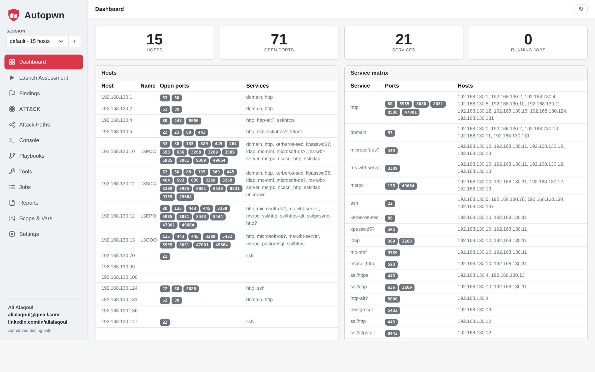
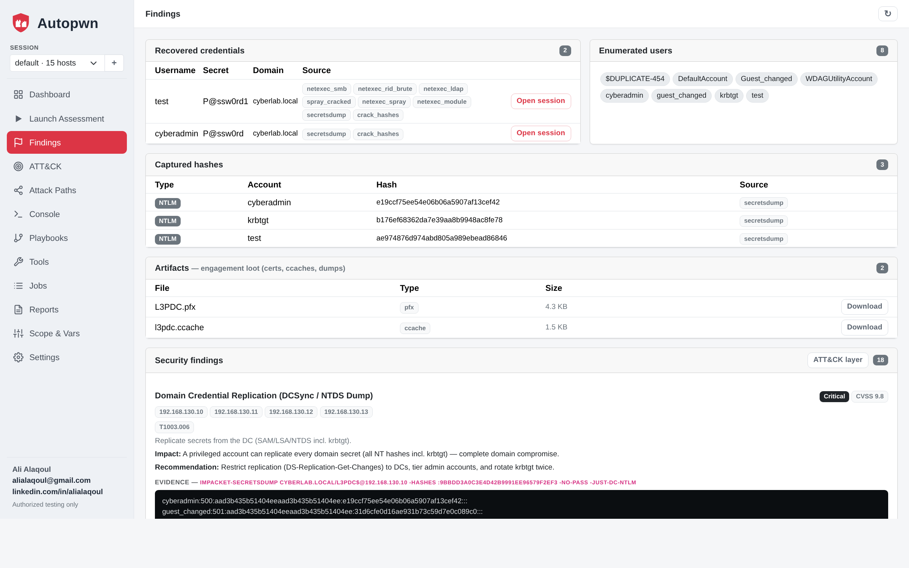
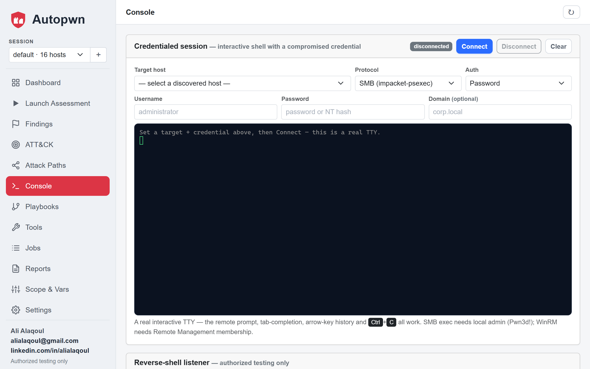
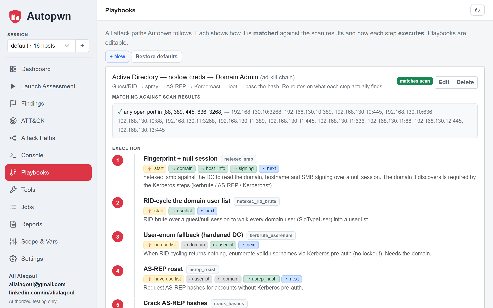
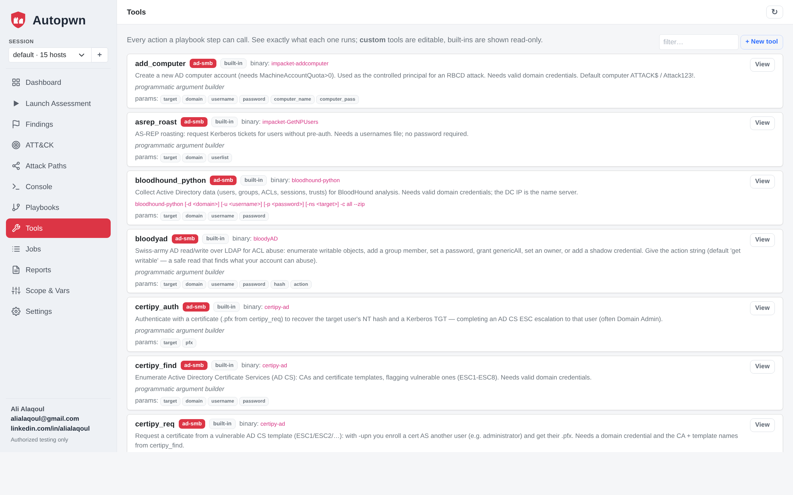
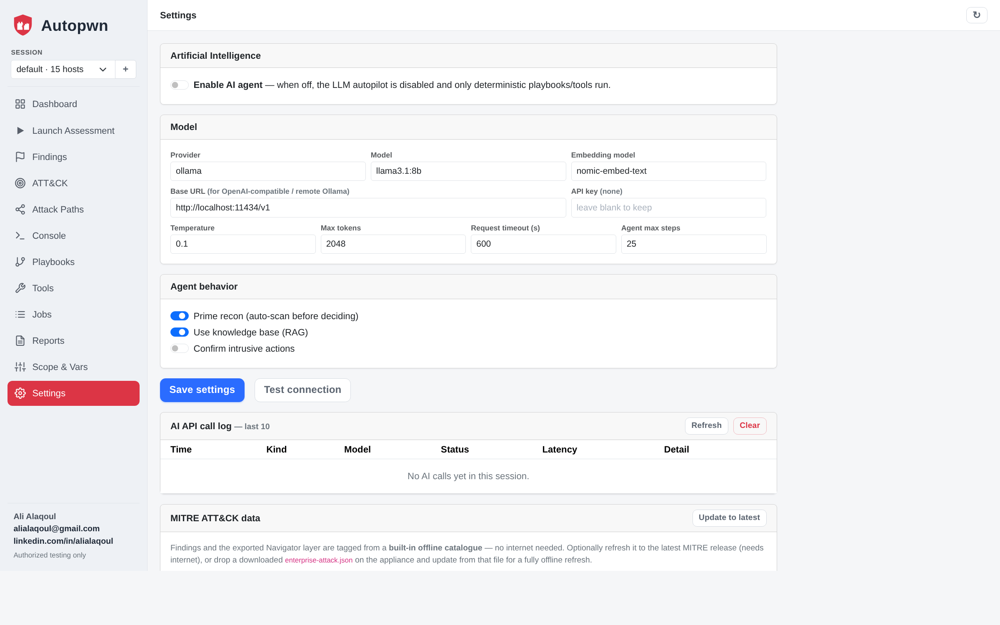
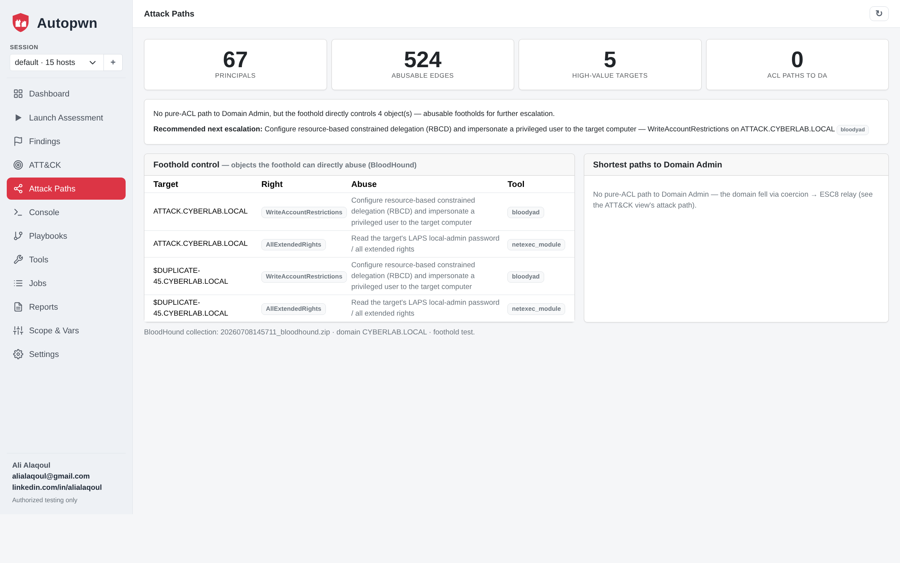
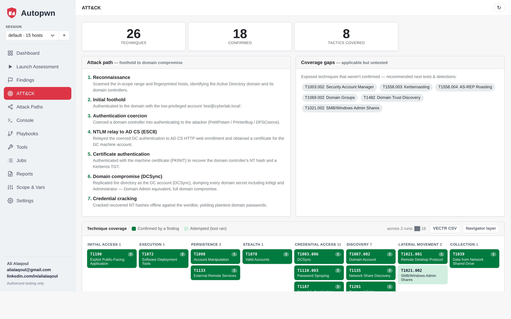

# Autopwn

**An AI agent that orchestrates real security tools to test the security of
networks, web applications, Active Directory, and other systems — driven by a
local or cloud LLM, and gated by an explicit authorization scope.**

Autopwn does not reinvent scanners. It *orchestrates* the industry-standard
ones — nmap, netexec, nuclei, impacket, ffuf, and more — the way a human operator
does: it plans a methodology, picks the right tool, reads the raw output,
correlates findings, and decides the next step. You can point it at a target and
let it run on **autopilot** — with **or without AI** — or drive individual tools
yourself, from a **web console** or the CLI.

- **Author:** Ali Alaqoul — <alialaqoul@gmail.com>
- **License:** MIT

## Web console

A Bootstrap single-page console served by uvicorn (`autopwn web`). Everything is
vendored, so it runs fully offline on an isolated lab network. Launch an
assessment (AI **or** deterministic no-AI mode), watch findings build in real
time, drive playbooks/tools, open interactive sessions, and export reports.

<p align="center"></p>

**Findings** — recovered credentials (cracked plaintext *or* NT hash for
pass-the-hash), **captured hashes** (Kerberoast / AS-REP / NTLM), engagement
**artifacts** (certificates, ccaches, NTDS dumps), enumerated users, and
severity-rated findings with CVSS, **ATT&CK technique IDs**, and evidence:

<p align="center"></p>

**Console (C2)** — open a **real interactive TTY** (xterm.js) from a recovered
credential over WinRM (evil-winrm) or SMB (impacket) with a password or
**pass-the-hash** — the remote prompt, tab-completion, arrow-key history and
`Ctrl-C` all work — plus a netcat-style reverse-shell listener:

<p align="center"></p>

**Playbooks** — the attack paths *and* the report findings, unified and editable:
each step names the **tool that runs**, its trigger, arguments, and the
data it consumes/produces; give a step a **severity** and it becomes a report
finding (with CVSS/impact/recommendation) when it actually fires:

<p align="center"></p>

<p align="center">
  
  
</p>

**Attack Paths (offline BloodHound)** — parse a `bloodhound-python` collection
into an AD graph and surface the foothold's directly-abusable objects and the
shortest path to Domain Admin — no Neo4j / Docker / CE server needed:

<p align="center"></p>

**MITRE ATT&CK** — every finding and tool maps to ATT&CK techniques: the
foothold→domain-compromise attack path, coverage gaps (applicable-but-untested
techniques), and a Navigator-style coverage matrix — exported as a **Navigator
layer** or **VECTR CSV**. Ships with the full offline ATT&CK catalogue (697
techniques), no internet required:

<p align="center"></p>

---

## ⚠️ Legal and authorized use only

This tool is for **authorized security testing, education, and defensive
research only.** It refuses to run against any target that is not listed in an
authorization *scope* file that you define. Testing systems you do not own or
lack **written permission** to test is illegal in most jurisdictions. You are
solely responsible for staying within your authorized scope. The software is
provided "as is", without warranty (see [LICENSE](LICENSE)).

---

## Features

- **Web console** (`autopwn web`) — an offline Bootstrap SPA over the engine:
  dashboard, launch, findings, an interactive **C2 Console**, editable
  playbooks/tools, jobs with live logs, reports, scope/vars, and settings.
- **AI is optional — your choice** — a master switch (and a per-launch **mode**
  toggle) picks the **AI autopilot** (LLM agent) or the **Playbook autopilot
  (no AI)**: recon a target/range, run every matching playbook deterministically,
  and report. Reliable and reproducible without any model.
- **Interactive credentialed sessions (C2)** — from a recovered credential, open a
  **real interactive TTY** (xterm.js) over WinRM (evil-winrm) or SMB (impacket)
  with a password or **pass-the-hash** — remote prompt, tab-completion, arrow-key
  history and `Ctrl-C` all work; `cd`/state persist. Plus a reverse-shell **listener**.
- **Automatic AD escalation** — from a single domain user, an assessment runs the
  no-fix chain end to end and feeds the loot back into the session: coerce a DC →
  NTLM-relay to AD CS web enrollment (**ESC8**) → DC certificate → DCSync → crack
  the NT hashes. Hard-gated (root + credential + ESC8 CA + coercible DC) and
  best-effort, so it skips cleanly where it doesn't apply.
- **Offline BloodHound path analysis** — parse a `bloodhound-python` collection
  into an AD graph and compute the foothold's abusable objects and the shortest
  path to Domain Admin, entirely offline (no Neo4j / Docker / CE server).
- **Local privilege escalation triage** — `win_privesc` runs an automated
  post-foothold host audit (SeImpersonate → potato, SeBackup/SeRestore,
  AlwaysInstallElevated, unquoted service paths, autologon credentials, UAC) and
  parses each abusable vector into an ATT&CK-tagged finding — the WinPEAS pass,
  structured.
- **IPv6 DNS takeover (`mitm6`)** — with **no credentials**, poison IPv6 DNS/WPAD
  to coerce NTLM off the wire and feed it to the relay (LDAP RBCD / AD CS ESC8) —
  the classic on-the-wire internal foothold, alongside Responder-style poisoning.
- **MITRE ATT&CK mapping** — every finding and tool maps to ATT&CK techniques;
  export a **Navigator layer** or **VECTR CSV** with technique-level coverage and
  applicable-but-untested gaps. Ships with the full offline ATT&CK catalogue (697
  techniques) — no internet required.
- **Isolated sessions** — each engagement is a self-contained data directory,
  switchable from the console; launched jobs stay scoped to it.
- **Pluggable AI backends** — OpenAI, Ollama, AnythingLLM, LM Studio, or any
  OpenAI-compatible endpoint. Local models run fully offline. Test the connection
  and audit every LLM request/response from the **Settings** page.
- **Authorization gate** — every tool call is checked against your scope
  (allow/deny CIDRs, hostnames, and an expiry date) before any packet is sent.
- **Full tool coverage** — 65+ tools across recon, web, SMB/Active Directory, and
  credential testing, run through a safe, auditable wrapper. The AD toolkit covers
  the modern kill chain end to end: RID-cycling, spraying, AS-REP/Kerberoast,
  BloodHound, **AD CS (ESC)**, **MSSQL** (xp_cmdshell), **coercion + NTLM relay**
  (PetitPotam/PrinterBug), **delegation** (unconstrained/constrained/RBCD),
  **ACL abuse** + **shadow credentials**, **domain/forest trusts** (child→parent
  SID history), DCSync, and golden/silver tickets.
- **Autopilot** — give it just a target and it fingerprints the host, then
  adapts its methodology to whatever it is (DC, IIS/nginx/Apache, database, mail,
  remote-access host, …).
- **Authenticated / assumed-breach engagements** — supply starting credentials
  (`--username/--password/--domain/--hash`, or the menu prompt) and they flow into
  every credentialed tool and the agent from step one.
- **Editable playbooks = the execution engine** — an attack path is an ordered
  list of **steps**, each naming one built-in tool, a trigger (when it runs), and
  its arguments; Autopwn parses every tool's output into shared variables that
  auto-fill the next step. The full no-creds → Domain Admin AD chain, Kerberoast,
  ADCS/ESC, MSSQL, coercion+relay, delegation, ACL abuse, trusts, privilege
  escalation, and critical-CVE checks ship as 28 playbooks — each editable in the
  console and driven from real output, not an LLM. A step with a severity becomes a
  report finding when it actually fires.
- **Lab-validated for accuracy** — a built-in verify harness (`autopwn verify`)
  runs a playbook against a target and *asserts its finding fires*, stamping a
  dated `verified` record. The shipped playbooks are proven against the GOAD lab
  rather than assumed to work.
- **Adaptive, self-improving RAG** — a knowledge base of pentest playbooks is
  retrieved each step, **conditioned on the real state** (open ports + discovered
  facts) so retrieval tracks results; successful runs are distilled back into the
  corpus automatically.
- **Anti-flailing guardrails** — the agent never guesses passwords one-by-one, and
  an "already tried" ledger pushes it toward new branches instead of loops.
- **Grounded reporting** — deterministic role/exposure/attack-path analysis plus
  an LLM summary, exported as HTML/DOCX/Markdown with engagement details.
- **Extensible** — add a tool (a few lines of declarative config) or teach it new
  tradecraft (drop a `.md` playbook into `autopwn/knowledge/`).
- **Full transcripts** — every agent session is logged to JSON for reporting.

---

## Architecture

```
CLI (autopwn) / Web console
  ├── Playbook engine   (tool-per-step sequences; harvest → variable → autofill)
  ├── Verify harness    (run a playbook vs a lab, assert its finding fires)
  ├── Agent  ── reason → act → observe loop
  │     ├── LLM provider (OpenAI / Ollama / AnythingLLM / any OpenAI-compatible)
  │     └── State-conditioned RAG (playbooks retrieved by real ports + facts)
  ├── Tool registry     (auto-loads only tools installed on the host)
  ├── Findings engine   (per-step, fires only on evidenced artifacts)
  └── Authorization     (scope gate — enforced on every tool)
```

---

## Requirements

- **Python 3.10+**
- A Linux host is strongly recommended for the security tools — **Kali Linux**
  ships with almost all of them preinstalled. (The core agent and the native
  scanners run on Windows/macOS too.)
- An LLM backend: a local **Ollama** install (recommended for offline use) or an
  API key for a cloud provider.

---

## Installation

### 1. Get the code and Python dependencies

```bash
git clone https://github.com/alialaqoul/autopwn.git
cd autopwn
python3 -m venv .venv
source .venv/bin/activate            # Windows: .venv\Scripts\activate
pip install -e .                     # installs deps + the `autopwn` command
pip install -e '.[web]'              # optional: the web console (FastAPI + uvicorn)
```

After `pip install -e .` you can run **`autopwn`** directly. If you'd rather not
install, use `python -m autopwn` in place of `autopwn` everywhere below.

**Web console:** `autopwn web` (add `--host 0.0.0.0 --port 8777` to expose it),
then browse to the URL. Bootstrap is vendored, so it works with no internet.
For interactive C2 sessions install `evil-winrm` and `impacket` (both ship with
Kali). The console launches the same jobs the CLI does and shares the results.

### 2. Install the security tools (Kali Linux)

Most are already present on Kali. To be sure:

```bash
sudo apt update
sudo apt install -y nmap masscan dnsrecon whatweb nikto ffuf gobuster \
  wpscan sqlmap netexec smbmap smbclient ldap-utils enum4linux-ng hydra \
  exploitdb nuclei seclists subfinder httpx-toolkit feroxbuster testssl.sh \
  arjun bloodhound.py

# seclists provides the username/password wordlists that kerbrute / AS-REP /
# hydra default to (/usr/share/seclists/...). Install it, or pass your own.

# kerbrute is not in apt — install the prebuilt binary:
sudo curl -fsSL -o /usr/local/bin/kerbrute \
  https://github.com/ropnop/kerbrute/releases/latest/download/kerbrute_linux_amd64
sudo chmod +x /usr/local/bin/kerbrute

# impacket (GetNPUsers, GetUserSPNs, secretsdump, findDelegation, ticketer,
# lookupsid, raiseChild, addcomputer, rbcd, getST, dacledit, mssqlclient …):
pipx install impacket        # or: sudo apt install -y python3-impacket

# extra AD tooling used by the ADCS / delegation / ACL / coercion playbooks:
pipx install certipy-ad      # AD CS (find/req/auth/shadow)  — point DNS at a DC
pipx install coercer         # PetitPotam / PrinterBug coercion
pipx install bloodyAD        # ACL abuse (get writable / grant / shadow)
pipx install netexec         # nxc (SMB/LDAP/MSSQL + modules: gpp_password, laps, …)
pipx install git+https://github.com/ShutdownRepo/targetedKerberoast   # targeted roast
```

> pipx installs land in `~/.local/bin`; Autopwn searches that path automatically.
> `certipy` needs DNS that resolves the domain — on an isolated lab, point
> `/etc/resolv.conf` at a domain controller.

Tools you don't install are simply hidden from the agent — nothing breaks. Check
what's available any time with `python -m autopwn tools`.

### 3. Install and start an LLM (Ollama, recommended)

```bash
curl -fsSL https://ollama.com/install.sh | sh
ollama pull llama3.1:8b              # good tool-calling; ~4.9 GB
```

Ollama then serves an OpenAI-compatible API on `http://localhost:11434`.

---

## Configuration

Copy the examples and edit them:

```bash
cp config.example.yaml config.yaml
cp scope.example.yaml  scope.yaml
```

### `config.yaml` — pick your AI backend

```yaml
llm:
  provider: ollama                    # openai | ollama | anythingllm | openai_compatible
  model: llama3.1:8b
  base_url: http://localhost:11434/v1
  temperature: 0.2
  request_timeout: 600                # high, because local CPU inference is slow
agent:
  max_steps: 25
  confirm_active_actions: false       # true = ask before each intrusive tool
```

Default base URLs are filled in per provider if you omit `base_url`:

| provider            | default base URL                       |
|---------------------|----------------------------------------|
| `openai`            | `https://api.openai.com/v1`            |
| `ollama`            | `http://localhost:11434/v1`            |
| `anythingllm`       | `http://localhost:3001/api/v1/openai`  |
| `openai_compatible` | `http://localhost:8000/v1` (e.g. vLLM) |
| LM Studio           | use `openai_compatible` + `http://localhost:1234/v1` |

Keep secrets out of the file — use environment variables instead:

```bash
export AUTOPWN_LLM_API_KEY=sk-...        # e.g. OpenAI
export AUTOPWN_LLM_BASE_URL=...          # override base URL
export AUTOPWN_LLM_MODEL=...             # override model
```

#### Tuning the agent for local models (accuracy + speed)

Small local models tend to narrate instead of acting and are slow on CPU. Three
`agent:` options (on by default) make them reliable and faster:

```yaml
agent:
  structured: true       # force ONE JSON action per turn — no prose/tutorials
  prime_recon: true      # inject recon (from the store or a quick nmap) as step 0
  tool_top_k: 8          # pass only the 8 most relevant tools per step (needs embed_model)
llm:
  embed_model: nomic-embed-text   # ollama pull nomic-embed-text
```

- **`structured`** uses the model's JSON mode so it *cannot* return a tutorial —
  it must emit `{"action": "...", "parameters": {...}}` or `finish`.
- **`prime_recon`** gives the model real ports/services up front; small models
  react to data far better than they plan from nothing.
- **`tool_top_k`** semantically retrieves the most relevant tools each step
  (SMB query → SMB tools, web query → web tools), which improves selection and
  shrinks the prompt for faster inference. Set `0` to pass all tools.

For the best results overall, use a stronger tool-calling model — `qwen2.5:7b`
locally, or point the `openai` provider at a cloud model while all tools still
run locally.

### `scope.yaml` — what you're allowed to test

```yaml
engagement: ""                        # optional; shown as the report title
authorized_by: "your-name"
expires: "2026-12-31"                 # tool refuses to run after this date
allow:
  - 192.168.56.0/24                   # CIDR ranges,
  - 10.0.0.5                          # single IPs,
  - testphp.vulnweb.com               # or hostnames
deny:
  - 192.168.56.1                      # deny always wins over allow
```

Rules and targets may be **single IPs, CIDR ranges, or hostnames** — you can
authorize and scan a whole `/24`. A `deny` entry inside a scanned range is
carved out automatically (passed to nmap as `--exclude`).

**Auto-add:** when you launch a scan/agent on a target that isn't yet in scope
(via the CLI scan commands or the interactive menu), Autopwn adds it to the
`allow` list and records it in `scope.yaml` — so scanning "just works" while
still keeping an auditable record of what you authorized. Anything on the `deny`
list is never auto-added. Manage the lists interactively from the menu's
**Scope** option (add/remove allow & deny, check a target).

---

## Usage

All commands are run as `python -m autopwn <command>` (or `autopwn <command>`
if installed on your PATH).

### See the toolbox

```bash
python -m autopwn tools
```
Lists every tool, whether its binary is installed, and whether it's intrusive.

### Check / inspect scope

```bash
python -m autopwn scope --target 192.168.130.10
```

### One-shot recon (no AI needed — fast)

```bash
python -m autopwn recon --target 192.168.130.10 --profile default
```
Profiles: `quick`, `default`, `full_tcp`, `service_os`, `vuln`, `udp_top`.

### Sweep a range → service/host matrix

Scan a whole range and get a table grouping **each service with the hosts that
expose it** (e.g. every machine running LDAP):

```bash
python -m autopwn sweep --target 192.168.130.0/24
python -m autopwn services            # re-show the matrix from stored results
python -m autopwn services --hosts    # also show a per-host table
```

All scans (sweep, recon, and the agent's own scans) feed one shared results
store, so the matrix always reflects everything discovered so far. In the menu,
**Results** gives a numbered host list you drill into for each host's detail.

### Run the agent in the background + watch it

Long agent runs can be detached so your terminal stays free — and other
`autopwn` commands keep working against the same shared results while it runs:

```bash
python -m autopwn agent --target 192.168.130.10 --background   # prints a job id
python -m autopwn jobs                                         # list jobs
python -m autopwn watch <job-id>                               # stream live output
python -m autopwn stop  <job-id>                               # stop a job
```

### Run a single tool directly

```bash
python -m autopwn run --tool netexec_smb --set target=192.168.130.10
python -m autopwn run --tool nuclei --set url=http://192.168.130.10/ --set severity=critical,high
python -m autopwn run --tool ffuf --set url=http://192.168.130.10/FUZZ
```
Repeat `--set key=value` for each argument (see each tool's parameters in
`tools`).

**Run a tool against every applicable host** — after a `sweep`, fan a tool out
across all hosts exposing its service (SMB tools → every host with 445, web
tools → every web URL, LDAP tools → every DC, …). `--set` adds shared arguments
such as credentials:

```bash
autopwn run --tool netexec_smb --all                       # all SMB hosts
autopwn run --tool ldapsearch_anon --set base_dn=DC=corp,DC=local --all
autopwn run --tool nuclei --all                            # all web URLs
autopwn run --tool netexec_smb --set username=admin --set password=P@ss --all
```

The interactive menu's **Run a single tool** option shows each tool with how
many discovered hosts it applies to, then offers "all applicable hosts" or a
single manual target.

### The AI agent

**Autopilot** — just give it a target and it decides everything:

```bash
python -m autopwn agent --target 192.168.130.10
```

**Custom objective** — when you want something specific:

```bash
python -m autopwn agent --objective "Enumerate SMB shares and find AS-REP roastable users on 192.168.130.10"
```

Every session writes a full JSON transcript to `logs/`.

### Authenticated / assumed-breach engagements

Real engagements often start **with** a credential. Supply it up front and it
seeds the shared store, so every credentialed tool and the agent use it from the
first step (no waiting to "discover" it):

```bash
# password auth
autopwn agent --target 10.49.128.71 \
  --username j.smith --password 'JSmith@IT2024' --domain ctf.local

# pass-the-hash
autopwn agent --target 10.49.128.71 \
  --username Administrator --hash aad3b...:2dfe... --domain ctf.local
```

The interactive **AI-agent** menu also prompts for optional starting credentials
(username / password / NTLM hash / domain) before launch. From there the agent
runs authenticated enumeration (BloodHound, Kerberoast, LDAP, share/SYSVOL
looting) and can chain all the way to Domain Admin — e.g. via the built-in RBCD
path (`add_computer` → `rbcd` → `get_st` S4U2Proxy → DCSync).

### Playbooks — run a whole attack path

A playbook is an editable, ordered sequence of built-in tools. Run one against a
target and Autopwn executes each step in order, parsing each tool's output into
variables that feed the next, streaming every step, and raising a report finding
whenever a step fires:

```bash
# no-creds → Domain Admin AD chain
autopwn playbook --id ad-kill-chain --target 10.0.0.10 --domain corp.local

# privilege escalation from ONE unprivileged domain user → map every path
autopwn playbook --id privesc-ad        --target 10.0.0.11 --domain corp.local -u user -p pass

# assumed-breach paths (seed a credential)
autopwn playbook --id kerberoast-da     --target 10.0.0.11 --domain corp.local -u user -p pass
autopwn playbook --id adcs-esc          --target 10.0.0.10 --domain corp.local -u user -p pass
autopwn playbook --id delegation-abuse  --target 10.0.0.11 --domain corp.local -u user -p pass
autopwn playbook --id trust-abuse       --target 10.0.0.11 --domain corp.local -u user -p pass
```

The 27 built-in playbooks cover the full GOAD/AD technique set: `ad-kill-chain`,
`kerberoast-da`, `adcs-esc` (full AD CS ESC1–ESC13 audit + exploit),
`mssql-foothold`, `smb-relay` (coercion), `rbcd`,
`domain-dominance`, `acl-abuse`, `shadow-credentials`, `delegation-abuse`,
`trust-abuse`, `creds-in-ad`, `relay-adcs-esc8` (coerce→relay→ESC8→DA — the
built-in **`ntlm_relay`** tool orchestrates the whole listener+coercion end to
end against the in-scope target; run as root via `sudo autopwn run --tool
ntlm_relay`), `ipv6-relay` (mitm6 IPv6/WPAD takeover → relay, no creds),
`ad-cve-check` (ZeroLogon/noPac/PrintNightmare/MS17-010/coercion — non-destructive
checks), `sccm-attack` (SCCM/MECM enum + abuse), `password-policy`, `dpapi-loot`, `unauth-ad-roast` (pre2k/timeroast, no
creds), and — from a single unprivileged domain user — **`privesc-ad`** (enumerate
every escalation path in one run) and **`privesc-local`** (Windows local → SYSTEM),
plus detection playbooks (SMB signing/null-auth, RDP, WSUS, …). All are editable in
the web console.

### Verify — prove a playbook against a lab

The verify harness runs a playbook and **asserts its finding fires**, then stamps
a dated `verified` record in `logs/verification.json`:

```bash
autopwn verify --id kerberoast-da --target 10.0.0.11 --domain corp.local \
  -u user -p pass --expect "Kerberoastable Service Accounts"

autopwn verify --suite examples/goad-verify.json      # a whole suite
```

This is how the shipped playbooks are kept accurate — each is proven against the
GOAD lab, not assumed to work.

### Reports & engagement details

Every agent run captures **engagement metadata** and auto-exports a professional
report in **HTML, DOCX, and Markdown** alongside its transcript in `logs/`:

```bash
autopwn agent --target 10.0.0.10 \
  --engagement "Acme internal assessment" --client "Acme Corp" \
  --assessor "Your Name" --authorized-by "J. Smith"
```

In the interactive menu, the AI-agent flow prompts for these details (with
sensible defaults) before launching. Re-export any saved session on demand:

```bash
autopwn report --format html,docx,md          # latest session
autopwn report --transcript logs/session-YYYYMMDD-HHMMSS.json --format docx
```

The report follows a standard pentest structure — executive summary, finding
summary (severity counts + findings table), scope overview, testing process
(methodology + tools used), per-finding detail (**Description / Evidence –
Command / Evidence – Output / Impact / Recommendation**), prioritised
recommendations, and a command-log appendix. Findings are derived generically
from the discovered data (SMB signing, null auth, WSUS-over-HTTP, exposed
consoles/RDP, missing headers, …) — nothing is tied to a specific environment.
DOCX needs `python-docx` (in `requirements.txt`); Markdown and HTML work with no
extra dependencies. Loopback/localhost is filtered out and the executive summary
is cleaned of tool noise so reports stay client-ready.

### Interactive menu

Prefer menus to flags? Run with no arguments (or `autopwn menu`) for a
number/letter-driven interface to everything above. Each option opens its own
sub-menu, the screen stays anchored at the top, and results pause for review
before you continue.

```bash
python -m autopwn            # or: autopwn menu
```

The menu is grouped into **Manual**, **AI-Assisted**, **Configuration**, and
**Maintenance** categories, each colour-accented, with sequential numbering:

| Group | # | Option | What it does |
|---|---|--------|--------------|
| 🛠 **Manual** | **1** | Scan | Sweep a host/range/CIDR (auto-adds it to scope) → service matrix |
| | **2** | Results | Service→hosts matrix, or a numbered host list you drill into for port/service detail |
| | **3** | Run a single tool | Pick a tool **by number** (grouped by category) → run against **all applicable hosts** or one target |
| | **4** | List tools | The full catalog with install status, grouped by category |
| 🤖 **AI-Assisted** | **5** | AI agent | Autopilot on a target, or a custom objective (with optional starting credentials) — launched as a background job |
| | **6** | Jobs | List / watch (live output) / stop background agent runs |
| ⚙ **Configuration** | **7** | Scope | View and add/remove allow & deny entries; check a target |
| | **8** | Variables | Discovered domain / credentials / …, and which tools use each |
| 🧹 **Maintenance** | **9** | Clear ALL | Reset results + variables and delete saved reports & finished jobs (running jobs kept) |

**Pick a tool by number, then fire it at every applicable host** — and **drill
into a single host** for its ports and services.

---

## Tool catalog

65+ tools across five categories (run `autopwn tools` for the live list with
install status):

| Category | Tools |
|---|---|
| **recon** | `nmap_scan`, `native_port_scan`, `masscan`, `dns_recon`, `subfinder`, `amass`, `theharvester`, `httpx`, `gau` |
| **web** | `whatweb`, `http_probe`, `nikto`, `nuclei`, `ffuf`, `gobuster_dir`, `feroxbuster`, `katana`, `wpscan`, `sqlmap`, `arjun`, `testssl`, `subzy` |
| **ad-smb** | `netexec_smb`, `netexec_rid_brute`, `netexec_spray`, `netexec_winrm`, `netexec_ldap`, `netexec_mssql`, `netexec_module`, `smb_get`, `smb_loot`, `enum4linux`, `smbmap`, `smbclient_shares`, `ldapsearch_anon`, `kerbrute_userenum`, `asrep_roast`, `kerberoast`, `targeted_kerberoast`, `bloodhound_python`, `bloodyad`, `dacledit`, `finddelegation`, `add_computer`, `rbcd`, `get_st`, `ticketer`, `lookupsid`, `raisechild`, `coercer`, `certipy_find`, `certipy_req`, `certipy_auth`, `certipy_shadow`, `secretsdump`, `ntlm_relay`, `mitm6`, `win_privesc` |
| **credentials** | `crack_hashes`, `spray_cracked`, `hydra`, `john`, `hashcat`, `hashid` |
| **exploit** | `searchsploit` |

The AD toolkit covers the modern kill chain: **RID-cycling** user enumeration,
**batch spraying** incl. `username==password` (no lockout), **pass-the-hash**,
**share/GPP/LAPS/description looting**, **AS-REP/Kerberoast** (incl. targeted),
**AD CS ESC** (find → request → auth → shadow), **MSSQL** exec, **coercion +
NTLM relay**, **delegation** (unconstrained/constrained/RBCD), **ACL abuse**,
**domain/forest trusts** (child→parent SID history), **DCSync**, and
**golden/silver tickets**.

Tools chain across steps automatically: `subfinder`/`amass` discover subdomains
(recorded as hosts) → `httpx` finds the live web ones → web tools run against
them; the AD roasting tools produce hashes that `crack_hashes`/`hashcat` crack;
and the **playbook engine** sequences a whole attack path, passing each tool's
parsed output into the next step.

Credentialed tools (Kerberoast, secretsdump, netexec with `-u/-p`, RBCD, hydra)
require valid credentials and are skipped until you have them (or supply them up
front for an authenticated engagement). `autopwn tools` shows the whole catalog
grouped by category with install status.

---

## Variables — the shared knowledge layer

Autopwn works in terms of **canonical variables** — `target`, `url`, `domain`,
`base_dn`, `username`, `password`, `dc_ip`, … . Each tool maps these to its own
CLI flags (e.g. `username → -u` for NetExec), so a value **learned once flows to
every tool that uses it**:

- **Seeding** — for an authenticated engagement, pass `--username/--password/
  --domain/--hash` (or the menu prompt) to set them before the first step.
- **Harvesting** — regex rules run over each tool's output and store what they
  find. Out of the box: the AD `domain`, host `name`/`os`, **credentials** from a
  NetExec `[+] domain\user:pass` success line, plus **branch signals** that drive
  path selection (`smb_guest`, `pwned`/`Pwn3d!`, `has_users`, `kerberoastable`,
  `asreproastable`).
- **Auto-fill** — stored variables populate any tool's matching parameters
  automatically (and `base_dn` is derived from `domain`). So after NetExec
  reveals the domain and valid creds, `kerberoast`, `secretsdump`, `ldapsearch`,
  etc. get them filled in without you re-typing.

See and manage them with `autopwn vars` (or menu → **Variables**), which also
shows which tool uses each variable and via which flag.

## Extending: add your own tool

Tools are declared, not hand-coded. The **easy way** is fully declarative — no
code, just a flag map (the canonical-variable → CLI-switch translation). Add a
`CommandSpec` to `autopwn/tools/catalog.py`:

```python
CommandSpec(
    name="netexec_winrm",
    category="ad-smb",
    description="Check WinRM access and run whoami with NetExec.",
    binary="nxc",
    parameters=_params({**_TARGET, **_AUTH}, ["target"]),
    subcommand=["winrm"],                       # leading tokens: `nxc winrm ...`
    positional=["target"],                      # -> host as a positional arg
    flags={"username": "-u", "password": "-p"}, # canonical var -> CLI flag
    fixed=["-x", "whoami"],                     # always-on args
    # optional: harvest=[HarvestRule("username", r"...")] to learn from output
)
```

That's a complete, working tool — argv is assembled as
`nxc winrm <target> -u <username> -p <password> -x whoami`, credentials/domain
auto-fill from discovered variables, and it's registered under its category.
For anything the flag map can't express, you can still pass a
`build_args=lambda k: [...]`. The registry auto-loads a tool when its binary is
on `PATH`, and the agent sees it immediately. No new classes required.

---

## Knowledge base (RAG) — teaching it tradecraft

The agent's decisions are grounded in a knowledge base of pentest playbooks in
`autopwn/knowledge/` (methodology, Active Directory, web, credentials, and
enterprise services like WSUS / AD CS / ePO). At each step the relevant playbook
is retrieved (embedded via `nomic-embed-text`, cached to disk) and injected into
the model — so it knows the technique sequence, the exact tool, and how to read
the output, instead of guessing.

Retrieval is **state-conditioned**: playbook sections carry `<!-- when: port:88,
fact:smb_guest -->` preconditions, and sections whose conditions match the *real*
situation (open ports + discovered facts) are boosted — so retrieval tracks what
the tools actually found, not just text similarity. Successful runs are also
**distilled back into the corpus** automatically (`learned.md`), so Autopwn
remembers new winning paths.

**This is how you make it smarter — no model retraining.** Drop a new `.md` file
into `autopwn/knowledge/` (write it in terms of Autopwn's tools, optionally with
a `when:` precondition tag), and it's automatically chunked, embedded, and
retrieved on the next run. After editing, delete
`autopwn/knowledge/.emb_cache.json` to force a re-embed.

Controlled by `agent.use_kb` / `agent.kb_top_k` in `config.yaml`.

## How the agent works

Each step layers several mechanisms so the model acts like it knows the playbook:
1. **Applicability** — only tools that fit the target's real open ports/banners
   are offered (no `wpscan` on a DC's WinRM port).
2. **Semantic tool retrieval** — of those, the top-k most relevant to the moment.
3. **State-conditioned RAG** — the matching methodology is injected into the
   prompt, boosted by the ports/facts discovered so far.
4. **Tried-ledger** — an "already tried" summary is injected so the model avoids
   repeating actions and explores a new branch instead of looping.

Then: the model requests a tool call (forced JSON, with a text fallback); the
tool is authorized against scope and run as a safe argument list (never a shell
string); its real output is fed back and **harvested for structured signals**
(domain, creds, SMB signing, `guest` enabled, `Pwn3d!` admin, Kerberoastable,
user counts). Two guardrails keep it grounded: it **never guesses passwords
one-by-one** (bulk testing is a deliberate `netexec_spray`), and repeated failed
logins abort the guess loop. For well-trodden paths, a **playbook** runs its
tool-per-step sequence deterministically and passes files (user lists, hashes,
loot) between steps — the thing scalar variables can't do. The loop repeats until
it produces a grounded findings report.

---

## Troubleshooting

- **"'X' is not installed"** — install the tool (see above) or ignore it; the
  agent only uses what's present.
- **LLM read timeout / "could not reach LLM"** — make sure your backend is
  running; for slow CPU-only local models, raise `llm.request_timeout` in
  `config.yaml`.
- **"NOT in the authorized scope"** — add the target to `allow:` in `scope.yaml`.
- **Agent stops early / loops on a small model** — use a larger model (e.g.
  `llama3.1:70b` or a cloud model); small models reason less reliably over
  multi-step tool use.

---

## Disclaimer

This project is intended for legal, authorized security assessments and
education. The author, Ali Alaqoul, assumes no liability and is not responsible
for any misuse or damage caused by this program. Use it only against systems you
own or are explicitly permitted to test.
